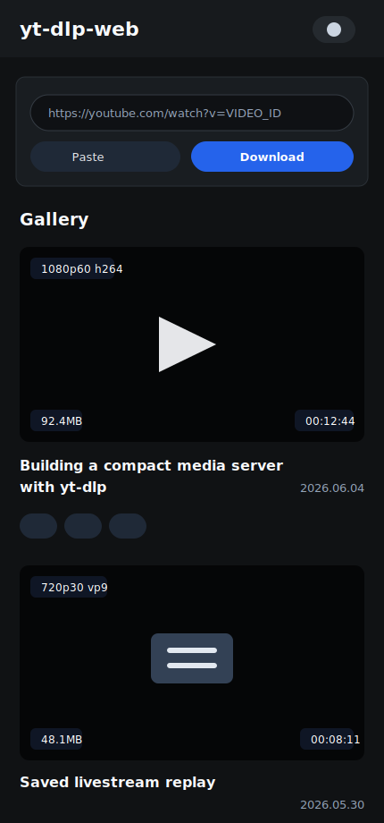
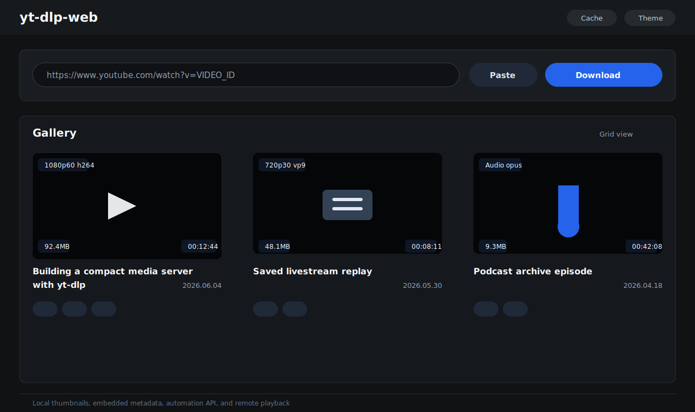

# yt-dlp-web

Self-hosted [yt-dlp](https://github.com/yt-dlp/yt-dlp) with a web UI for downloading, browsing, streaming, and managing videos on a remote server.

This fork publishes Docker images to GitHub Container Registry:

```text
ghcr.io/tues8557-source/yt-dlp-web:latest
```

[Supported sites](https://github.com/yt-dlp/yt-dlp/blob/master/supportedsites.md)

## Preview

| Mobile | Desktop |
| --- | --- |
|  |  |

## Features

- Download videos, audio, playlists, and livestreams through a web UI.
- Browse downloaded items in a responsive gallery or list view.
- Play downloaded videos from the browser, including playlist items.
- Store local thumbnails in `/cache/thumbnails` and use embedded video thumbnails as a fallback.
- Embed thumbnail, chapter markers, and metadata by default.
- Choose quality presets or explicit video/audio formats.
- Set output filename templates with yt-dlp variables.
- Download and embed subtitles.
- Use cookies, proxy settings, live-from-start, and cut-video options.
- Generate Safari-compatible playback variants when needed.
- Delete files while keeping list entries, or remove list entries separately.
- Start downloads from automation tools with the `/api/d` endpoint.

## Quick Start

Create a `docker-compose.yml` file:

```yaml
services:
  yt-dlp-web:
    image: ghcr.io/tues8557-source/yt-dlp-web:latest
    container_name: yt-dlp-web
    user: 1000:1000
    volumes:
      - /path/to/downloads:/downloads
      - /path/to/cache:/cache
    ports:
      - 3000:3000
    restart: unless-stopped
```

Start it:

```bash
docker compose up -d
```

Open:

```text
http://localhost:3000
```

The container needs write access to both mounted folders:

- `/downloads`: downloaded media files
- `/cache`: app cache, download list, cookies, local thumbnails

## Authentication

Authentication is disabled unless all three credential variables are set.

```yaml
environment:
  AUTH_SECRET: "Random_string_40_or_more_characters_recommended"
  CREDENTIAL_USERNAME: "username"
  CREDENTIAL_PASSWORD: "password"
```

When authentication is enabled, the web UI requires sign-in.

## Automation Download API

Set `API_TOKEN` to let trusted tools start downloads without opening the browser UI. This token currently applies to `/api/d`.

```yaml
environment:
  AUTH_SECRET: "Random_string_40_or_more_characters_recommended"
  CREDENTIAL_USERNAME: "username"
  CREDENTIAL_PASSWORD: "password"
  API_TOKEN: "Random_string_for_automation_download_api"
```

Example:

```bash
curl \
  -H "Authorization: Bearer $API_TOKEN" \
  "https://your-domain.example/api/d?url=https%3A%2F%2Fwww.youtube.com%2Fwatch%3Fv%3DVIDEO_ID"
```

For direct API downloads, these options default to enabled:

- `embedThumbnail=true`
- `embedChapters=true`
- `embedMetadata=true`

You can explicitly disable them:

```text
/api/d?url=...&embedThumbnail=false&embedChapters=false&embedMetadata=false
```

Useful query parameters:

| Parameter | Example | Description |
| --- | --- | --- |
| `url` | `https://www.youtube.com/watch?v=...` | Required media URL |
| `selectQuality` | `best`, `1080p`, `audio` | Quality preset when explicit formats are not selected |
| `outputFilename` | `%(title)s (%(id)s).%(ext)s` | yt-dlp output filename template |
| `embedSubs` | `true` | Embed subtitles |
| `subLangs` | `en,ko` | Subtitle languages |
| `usingCookies` | `true` | Use the server-side cookies file |
| `enableProxy` | `true` | Enable proxy |
| `proxyAddress` | `http://host:port` | Proxy address |
| `enableLiveFromStart` | `true` | Download livestreams from the start |
| `cutVideo` | `true` | Download a section only |
| `cutStartTime` | `00:01:00` | Section start |
| `cutEndTime` | `00:02:00` | Section end |

`outputFilename` must not end with `.desktop`, `.url`, or `.webloc`; yt-dlp 2026.06.09 blocks those dangerous output file types unless using its write-link feature.

## iOS Shortcut

You can use an iOS Shortcut to send shared URLs directly to the automation API without opening the web UI. Configure the shortcut with your deployed domain and, if authentication is enabled, your `API_TOKEN`.

Existing shortcut link:

```text
https://www.icloud.com/shortcuts/8b038411c518474bbfe566f9fbe1e046
```

## Updating yt-dlp

The container downloads a fresh yt-dlp binary at startup. You can override the download URL:

```yaml
environment:
  YT_DLP_DOWNLOAD_URL: "https://github.com/yt-dlp/yt-dlp/releases/latest/download/yt-dlp"
```

You can also update manually inside a running container:

```bash
docker exec -u 0 -it yt-dlp-web /tmp/yt-dlp-bin/yt-dlp --update-to nightly
docker exec -u 0 -it yt-dlp-web /tmp/yt-dlp-bin/yt-dlp --update-to stable@2024.08.06
```

## Development

Use Node.js 22 or newer. yt-dlp 2026.06.09 raised the minimum supported Node runtime to v22.

Install dependencies and run the Next.js dev server:

```bash
npm install
npm run dev
```

Build and lint:

```bash
npm run build
npm run lint
```

The app expects `/downloads` and `/cache` paths at runtime. Docker is the recommended development target when testing real downloads.

For local development without Docker, set `DOWNLOAD_PATH` and `CACHE_PATH` to writable folders before running the app.

## Stack

- yt-dlp
- ffmpeg
- Node.js 22+
- Next.js 14
- React 18
- TypeScript
- shadcn/ui
- Docker

## Notes

This project is a fork of `sooros5132/yt-dlp-web`. The README now documents this fork's current Docker image, authentication/API behavior, local thumbnail handling, and gallery changes.
